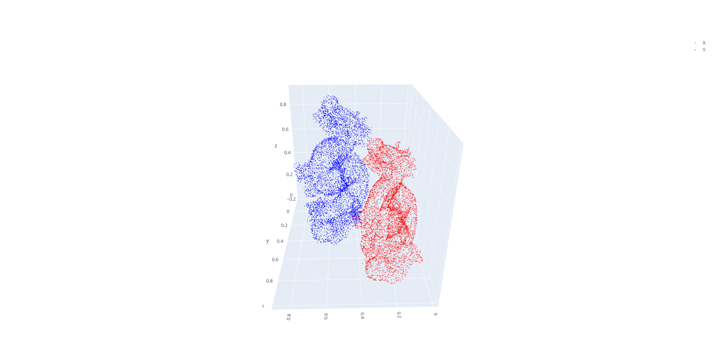
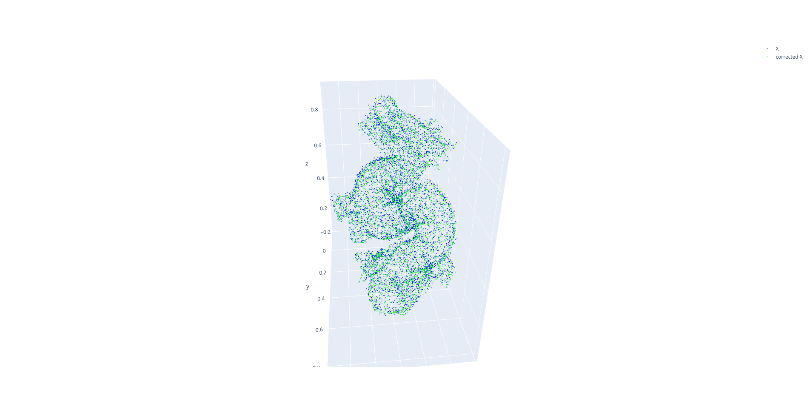
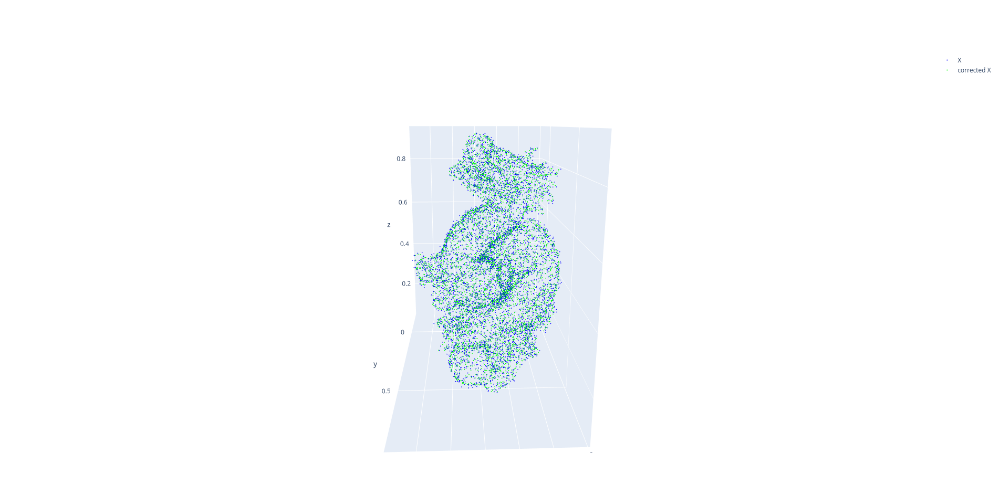
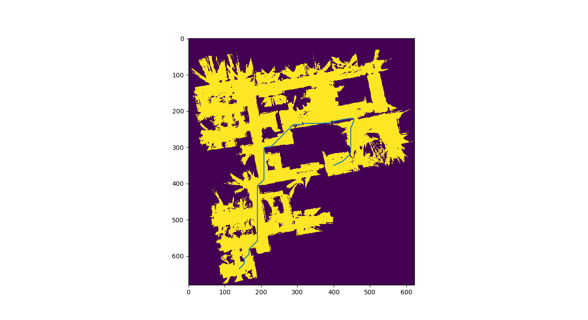
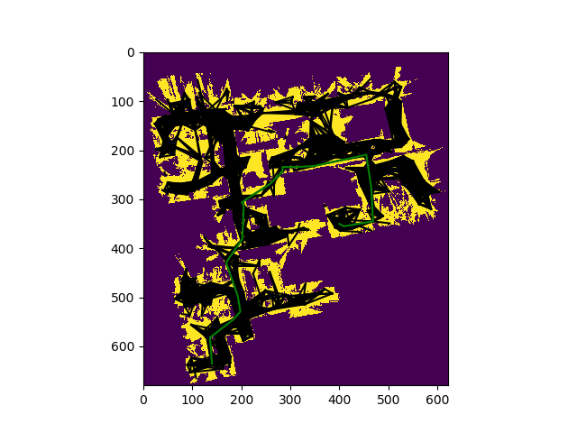

# robotics_implementations

#### This repo contains one of the most commonly used robotics algorithms I learned by implementing

**iterative_closest_point:** In this project I implemented Iterative closest point algorithm to calculate the transformation matrix between two point clouds, this implementation can be used to compute the odometry from a distortion corrected Lidar pointCloud.

**Instructions to run the file:**
I used very basic python packages to implement these algorithms so if there are any issues related to missing packages a simple `pip install {PACKAGE}` should work

```
cd ./iterative_closest_point

python3 icp.py # Run the Python file 

```
**Results:** Below is an image of both pointclouds befor correction in an image

The following image is obtained by transforming the first point cloud using ICP



**generalized_ICP:** This project is an implementation Generalized Iterative closest point algorithm to calculate the transformation matrix between two point clouds, this implementation can be used to compute the odometry from a distortion corrected Lidar pointCloud.

**Instructions to run the file:**

```
cd ./generalized_ICP

python3 main.py # Run the Python file 

```
**Results:** The same Point cloud is used to test the Generalized ICP algorithm as well. The following image is obtained by transforming the first point cloud using generalized-ICP


In conclusion, both techniques give similar results for this case but generalized is more robust than ICP


**A_star_implementation:** This is an implementation of A-star algorithm and used it on an occupancy grid to calculate the optimal path from point to point

**Instructions to run the file:**

```
cd ./A_star_implementation

python3 a_star.py # Run the Python file 

```
**Results:** The following binary map is converted to grid map and is used to implement A_star algorithm to compute optimal path

The following optimal path is computed between two points in the grid map



**PRM_planner:** This project is an implementation of Probabilistic Road Map path planner algorithm. I used the image of a map, created an occupancy grid from it, and used PRM algorithm to compute the optimal path to move from point to point

**Instructions to run the file:**

```
cd ./PRM_planner

python3 PRM_planner.py # Run the Python file 

```
**Results:** The same occupancy grid map is used for Probabilistic Road Map planner as well and the following nodes and a path using the nodes has been created for 2 points

